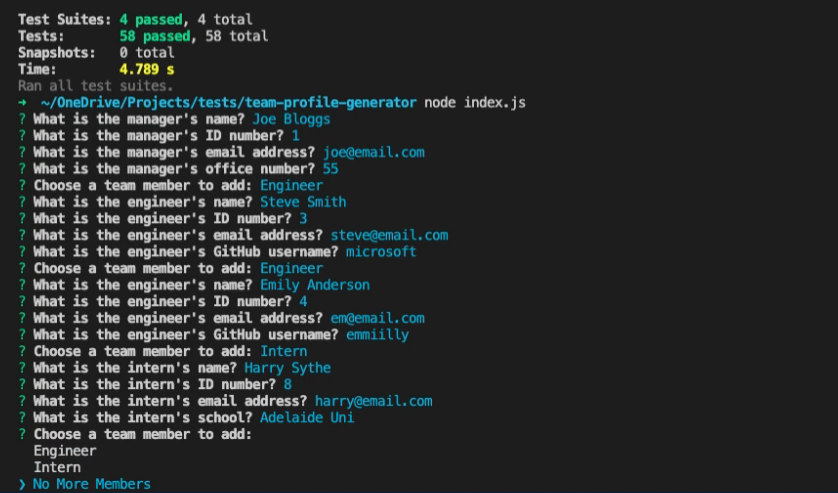

# Team Profile Generator

## Table of Contents
- [Description](#description)
- [Installation](#installation)
- [Usage](#usage)
- [Tests](#tests)
- [Credits](#credits)
- [License](#license)

## Description
Node.js command-line application that takes in information about employees on a software engineering team, then generates an HTML webpage that displays summaries for each person. The first member will be the team manager. You can then add as many engineers and/or interns as required.

For a video demonstation of how to install the application and generate a README file, please click below:

## Installation
Ensure you have saved the following files and folders to your desired directory:
- /__ tests__
- /dist
- /lib
- /src
- index.js
- package.json
- package-lock.json

Once you have your directory set up. Ensure you have navigated to that location in the terminal. Run the command `npm install` or the shorter version `npm i`. This will install all the dependancies for the project.

## Usage
You initialise the application by running the command `node index.js`. 

You will then be presented with prompts to create a profiles for your software development team. The first member will be the team manager. You can then add as many engineers and/or interns as required.

## Tests
In the root directory run the command `npm test`.

## Credits
This project idea is part of the [Adelaide University Coding Boot Camp](https://bootcamps.adelaide.edu.au).

## License
This project is released under the [MIT License](LICENSE).